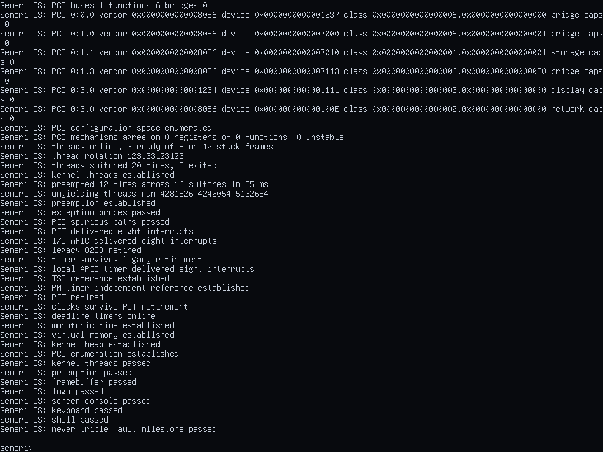

<p align="center">
  
</p>

<p align="center">
  
</p>

<p align="center">
  <strong>A small x86_64 operating system built from first principles.</strong><br>
  Hardware-aware, proof-driven, and growing into a graphical interactive system.
</p>

<p align="center">
  <a href="https://github.com/saudaljuaid/Seneri-OS/actions/workflows/verify.yml"></a>
  
  
  
  <a href="LICENSE"></a>
</p>

<p align="center">
  
</p>

<p align="center"><sub>The real Seneri framebuffer at 1024×768 in QEMU, after verified boot.</sub></p>

## ✦ What is Seneri?

Seneri is an independent, freestanding operating-system kernel—not a Linux
distribution and not a userspace simulation. It boots through Multiboot2,
constructs its own x86_64 environment, discovers hardware, schedules kernel
threads, draws a graphical console, accepts keyboard input, and ends at a small
interactive shell.

Correctness is part of the architecture: important claims are checked at boot,
exercised by deterministic QEMU scenarios, and challenged with deliberate
negative controls.

## ⚙️ What works today

| Area | Current capability |
| --- | --- |
| Boot and CPU | Protected-mode entry, long mode, GDT, TSS, IDT, exception diagnostics |
| Memory | Firmware memory map, physical frames, four-level paging, W^X, guarded heap and stacks |
| Interrupts and time | Local APIC, I/O APIC, retired PIC/PIT paths, PM timer, TSC, deadlines |
| Hardware discovery | ACPI validation plus read-only PCI/PCIe enumeration through ports and ECAM |
| Scheduling | Single-core kernel threads, context switching, deadline-driven preemption |
| Graphics | Linear framebuffer, Rust-decoded logo/font assets, cached surface, WC presentation |
| Interaction | Graphical text console, interrupt-driven PS/2 keyboard, built-in command shell |

The shell currently provides `help`, `echo`, `clear`, `uptime`, `mem`, `pci`,
`keys`, `threads`, and `version`.

## 🚀 Build and run

Ubuntu 24.04 or a compatible Debian-based environment is the reference host:

```sh
sudo apt-get install binutils gcc grub-common grub-pc-bin make mtools \
    qemu-system-x86 xorriso
rustup target add x86_64-unknown-none
make hooks
```

Then choose the level of proof you want:

```sh
make verify       # clean build plus ELF, Multiboot2, symbol, and W^X checks
make qemu-tests   # all deterministic fault, memory, device, and kernel scenarios
make smoke        # strict normal-boot contract
make run          # interactive graphical boot
```

## 🧭 Find your way around

- [`docs/MAP.md`](docs/MAP.md) — boot order, source ownership, and where to start reading.
- [`docs/WORKING_ON_SENERI.md`](docs/WORKING_ON_SENERI.md) — the local development loop.
- [`CONTRIBUTING.md`](CONTRIBUTING.md) — project rules and submission expectations.
- [`docs/HARDWARE_AND_APPLICATIONS.md`](docs/HARDWARE_AND_APPLICATIONS.md) — the boundary between kernel foundations and future applications.
- [`docs/DEBT.md`](docs/DEBT.md) — known limitations and intentionally deferred work.

Every substantial subsystem has its own document under [`docs/`](docs/), where
the invariants, processor rules, failure modes, measurements, and negative
controls live. The README stays an introduction; the documentation carries the
proof.

## 🚧 Current boundaries

Seneri is still a foundation-stage kernel. It is single-core and kernel-only;
there is no userspace, filesystem, storage driver, network stack, process
isolation, or general application ABI yet. Hardware evidence is strongest in
QEMU, with bare-metal coverage still an explicit project goal.

## 💚 Contributing

Small, reviewable increments are welcome. Start with
[`CONTRIBUTING.md`](CONTRIBUTING.md), install the hooks, and keep every new loop
bounded and every new refusal named.

Seneri OS is licensed under [GPL-3.0-only](LICENSE).
